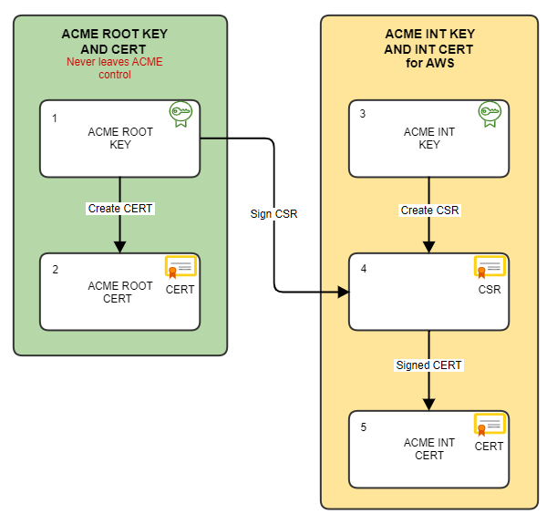

# POC Root CA demo

## Goal:

1. Create a Private CA
2. Create an intermediate certificate and install into AWS IoT CA Manager
3. Use AWS ACM-PCA and AWS ACM to sign device CSR certs
   * Get an AWS ACM-PCA CSR and sign with our ROOT cert
   * Use that to allow AWS ACM to sign the CSR 
4. Register that device CRT with IoT
5. Use the device CRT with both AWS IoT and your Private Company hosted services

## Proceedure

Note, in both config files:-

* the directory was set to "/rootb/ca"
* the defaults for Cert attributes were altered

Use the script to create the directory structure and files associated with CA management
```
$ create-dir-struct.sh
```

## Key and Cert Generation Flow





## Create the Root key and Cert

### Root key
Use a strong password

```
$ cd /rootb/ca
$ openssl genrsa -aes256 -out private/ca.key.pem 4096
$ chmod 400 private/ca.key.pem
```

### Certificate

```
cd /rootb/ca
$ openssl req \
	-new -x509 -days 73000 \
	-config openssl.cnf \
	-key private/ca.key.pem \
	-sha256 -extensions v3_ca \
	-out certs/ca.cert.pem
$ chmod 444 certs/ca.cert.pem
```

### Verify root certificate

```
$ openssl x509 -noout -text -in certs/ca.cert.pem
```

Insure the the v3 extensions are applied similar to the following:-
```
        X509v3 extensions:
            X509v3 Subject Key Identifier:
                8A:E4:94:16:2E:20:62:45:FE:E4:89:A1:A1:3C:AA:21:F9:A1:D6:24
            X509v3 Authority Key Identifier:
                keyid:8A:E4:94:16:2E:20:62:45:FE:E4:89:A1:A1:3C:AA:21:F9:A1:D6:24

            X509v3 Basic Constraints: critical
                CA:TRUE
            X509v3 Key Usage: critical
                Digital Signature, Certificate Sign, CRL Sign
```

## Create the Intermediate key and Intermediate Cert

### Create the Intermediate key

```
$ cd /rootb/ca
$ openssl genrsa -aes256 -out intermediate/private/intermediate.key.pem 4096
```

### Create the Intermediate CSR

```
$ cd /rootb/ca
$ openssl req -config intermediate/openssl.cnf -new -sha256 \
      -key intermediate/private/intermediate.key.pem \
      -out intermediate/csr/intermediate.csr.pem
```

#### Sign the CSR with the ROOT KEY to create the Cert

```
$ cd /rootb/ca
$ openssl ca -config openssl.cnf -extensions v3_intermediate_ca \
      -days 7300 -notext -md sha256 \
      -in intermediate/csr/intermediate.csr.pem \
      -out intermediate/certs/intermediate.cert.pem
$ chmod 444 intermediate/certs/intermediate.cert.pem
```

Create the intermediate chain file. Note the order, the root cert is last in the chain.
```
$ cd /rootb/ca
$ cat intermediate/certs/intermediate.cert.pem \
      certs/ca.cert.pem > intermediate/certs/ca-chain.cert.pem
$ chmod 444 intermediate/certs/ca-chain.cert.pem
```

## Details

```
Root key  : private/ca.key.pem
Root cert : certs/ca.cert.pem
Int  key  : intermediate/private/intermediate.key.pem
Int  cert : intermediate/certs/intermediate.cert.pem
Int chain : intermediate/certs/ca-chain.cert.pem
```

# AWS IoT CA

In this section we will use the previous CA we created to create a set of Certs for AWS IoT.
It is assumed you already have AWS credentials setup as the default profile.

To register a CA verification certificate with AWS IoT we need to acquire the registration key which is used in the CommonName field of the certificate.

```
$ aws iot get-registration-code 
{
    "registrationCode": "e3f3XXXXXXXXXXX20XXXXXXXXXXXXXXXXXXXXXXXXXXXXXXXXXXXXXXXXXXXXXXX"
}
```

Make a note of the registartion code to be used later.

### Create the AWS IoT  

* Common Name []: [reg code from previous step above]

```
$ cd /rootb/ca
$ openssl req -config intermediate/openssl.cnf -new -sha256 \
      -key intermediate/private/intermediate.key.pem \
      -out intermediate/csr/aws-iot.csr.pem
```

#### Sign the CSR with the Intermediate KEY to create the Cert

```
$ cd /rootb/ca
$ openssl ca -config intermediate/openssl.cnf -extensions v3_intermediate_ca \
      -days 7300 -notext -md sha256 \
      -in intermediate/csr/aws-iot.csr.pem \
      -out intermediate/certs/aws-iot.cert.pem
$ chmod 444 intermediate/certs/aws-iot.cert.pem
```

Create the intermediate chain file. Note the order, the root cert is last in the chain.
```
$ cd /rootb/ca
$ cat intermediate/certs/aws-iot.cert.pem \
      intermediate/certs/intermediate.cert.pem \
      certs/ca.cert.pem > intermediate/certs/aws-iot-chain.cert.pem
$ chmod 444 intermediate/certs/aws-iot-chain.cert.pem
```

This process created two new files (we ignore the csr file):-

```
intermediate/certs/aws-iot.cert.pem
intermediate/certs/aws-iot-chain.cert.pem
```

We now register these with AWS IoT

```
cd /rootb/ca

$ aws iot register-ca-certificate \
	--ca-certificate file://intermediate/certs/intermediate.cert.pem \
	--verification-certificate file://intermediate/certs/aws-iot-chain.cert.pem \
	--set-as-active \
	--allow-auto-registration \
	--tags 'Key=OWNER,Value=ajk'
# returns:-
{
    "certificateArn": "arn:aws:iot:eu-west-1:8582********:cacert/2ccc************************************************************",
    "certificateId": "2ccc************************************************************"
}
```

We now check it has registered with AWS IoT and is ACTIVE.
```
$ cd /rootb/ca
$ aws iot list-ca-certificates
```

The _certificateId_ should appear in the list of certificates.


# AWS ACM Private CA

In this section we will insert our intermediate signing CA key and certificates into ACM.

## Create a Private Certificate Authority

We begin by creating a root CA with AWS ACM Private CA. In this example we use a basic configuration file acm-pca-config.json

```
$ cd /rootb
$ aws acm-pca create-certificate-authority \
	--certificate-authority-configuration file://acm-pca-config.json \
	--certificate-authority-type "SUBORDINATE" \
	--idempotency-token 8735432
# returns
{
    "CertificateAuthorityArn": "arn:aws:acm-pca:eu-west-1:8582********:certificate-authority/9e1f9317-****-****-****-************"
}
```

Verify this PCA
```
$ cd /rootb
$ aws acm-pca list-certificate-authorities
$ aws acm-pca describe-certificate-authority \
	--certificate-authority-arn \
		arn:aws:acm-pca:eu-west-1:8582********:certificate-authority/9e1f9317-****-****-****-************
```

The description above should show "Status": "PENDING_CERTIFICATE".

### Install Certificates into the PCA

```
$ cd /rootb/ca
$ aws acm-pca import-certificate-authority-certificate \
	--certificate-authority-arn \
		arn:aws:acm-pca:eu-west-1:8582********:certificate-authority/9e1f9317-****-****-****-************ \
	--certificate file://intermediate/certs/aws-acm-pca.cert.pem \
	--certificate-chain file://certs/ca.cert.pem
```

## Issue a Device Certificate

To begin the process of getting a certificate for a device the device should create a private key and a certificate signing request. Simulated here:-

```
$ openssl genrsa -out device.key 2048
$ openssl req -new -sha256 -key device.key -out device.csr
```
In the above example we did not password protect the private key. However, when a device creates the private key it should protect it via the Operating System's mechanisms to manage private keys.

**Note** that the CommonName (CN) **must** be the device GUID. Other fields for the certificate subject are yet to be defined.

We now ask AWS ACM PCA to provide is with a signed certificate from our Private CA:-

```
$ aws acm-pca issue-certificate \
        --certificate-authority-arn "arn:aws:acm-pca:eu-west-1:8582********:certificate-authority/9e1f9317-****-****-****-************" \
        --csr file://device.csr \
        --signing-algorithm SHA256WITHRSA \
        --validity Value=364,Type="DAYS"
{
    "CertificateArn": "arn:aws:acm-pca:eu-west-1:858204861084:certificate-authority/80d65aa0-041d-441b-a731-a556ed0f23e8/certificate/a169*************"
}
```

Now [get the certificate]():-

```
$ aws acm-pca get-certificate \
	--certificate-authority-arn "arn:aws:acm-pca:eu-west-1:8582********:certificate-authority/9e1f9317-****-****-****-************" \
	--certificate-arn "arn:aws:acm-pca:eu-west-1:858204861084:certificate-authority/80d65aa0-041d-441b-a731-a556ed0f23e8/certificate/a169*************"
{
	"Certificate": "-----BEGIN CERTIFICATE-----\nMIIDqTCCApGgAwIBAgIRAKFphRwi................."
	"CertificateChain": "-----BEGIN CERTIFICATE-----\nMIIElDCCAnygAwIBAgICEAEwDQYJKoZIhvcNAQELBQAwc........................."
}
```

Notice that the returned value is a JSON object. The certs can be extracted using JQ thus:-

```
$ cat cert.json | jq -r .Certificate > device.crt
$ cat cert.json | jq -r .CertificateChain > device_chain.crt
```

We can validate that the issued certificate is for the device GUID we supplied in teh CSR thus:-

```
$ openssl x509 -in device.crt -text -noout| grep "Subject:"
	Subject: C = GB, ST = Some-State, O = NABLE, CN = b197cc51-c6f2-4347-acab-577117296395
```

We can validate the chain file is actually signed by our CA signing certificate thus:-

```
$ openssl x509 -in device_chain.crt -text -noout | grep "Subject:"
	Subject: C = GB, O = ACME, OU = Arch POC, CN = ACME-CA
```

We now have the device certificate that:-
* Needs to be registered with AWS IoT
* Sent to the device to use the certificate

## Register the Device Certificate with AWS IoT

We now register tihe device certificate with AWS IoT

```
$ aws iot register-certificate-without-ca \
        --status ACTIVE \
        --certificate-pem file://device.crt
{
    "certificateArn": "arn:aws:iot:eu-west-1:858204861084:cert/39c8e91e67e0df17d17d********************************************",
    "certificateId": "39c8e91e67e0df17d17d32910891dcfdff4a588647***********************"
}
```

Now attach a policy to the certificate (notice here that the policy is named and not an ARN)

```
$ aws iot attach-policy \
	--policy-name "POLICY_NAME" \
	--target "arn:aws:iot:eu-west-1:858204861084:cert/39c8e91e67e0df17d17d********************************************"
```

Finally, as a test, the certificate can be double checked:-

```
$ aws iot describe-certificate \
        --certificate-id "39c8e91e67e0df17d17d********************************************"
{
    "certificateDescription": {
        "certificateArn": "arn:aws:iot:eu-west-1:858204861084:cert/39c8e91e67e0df17d17d********************************************",
        "certificateId": "39c8e91e67e0df17d17d********************************************",
        "status": "ACTIVE",
        "certificatePem": "-----BEGIN CERTIFICATE-----\nMIIDqTCCApGgAwIBAgIRAKF******************************",
        "ownedBy": "858204******",
        "creationDate": 1658754661.42,
        "lastModifiedDate": 1658754661.42,
        "customerVersion": 1,
        "transferData": {},
        "generationId": "112cea4e-d070-4175-a9c8-***************",
        "validity": {
            "notBefore": 1658748293.0,
            "notAfter": 1690201493.0
        },
        "certificateMode": "SNI_ONLY"
    }
}
```

## Send the Device its Certificates

The last step is to return the device.crt and device_chain.crt certificates to the device to use to connect with AWS IoT.

The following describes testing an IoT connecting and registering using the certificate provided by AWS ACM PCA and a Docker Container

## References

* https://docs.aws.amazon.com/cli/latest/reference/iot
* https://docs.aws.amazon.com/cli/latest/reference/acm
* https://docs.aws.amazon.com/cli/latest/reference/acm-pca
* https://jamielinux.com/docs/openssl-certificate-authority/introduction.html
* https://aws.amazon.com/blogs/iot/how-to-manage-iot-device-certificate-rotation-using-aws-iot/
* https://aws.amazon.com/blogs/mobile/use-your-own-certificate-with-aws-iot
